---

# 🛡 사이버 보안 *Cyber Security* 🔐
###### ⚔ - Worldskills Korea ▫ National 2025 (Cyber Security Practices) - 🏹 [ *Written by NullBins* ]
- By default, the commands are executed as a root user.

# [ *Project-2* ] <*🌐Network security device settings💫*>

---

네트워크 보안 장비 설정(UTM/OPNsense + Router + WireGuard + WAF + DVWA)

> 해당 솔루션은 공개과제를 토대로 실제 대회 당일 변형을 감안해 **모든 설정(Configuration)을 끝까지 재현**할 수 있도록 **리눅스 명령어 + 설정파일 값**을 **순서대로** 정리함. 재부팅 제한(총 3회)을 고려해 **무부팅-적용**을 우선한다.

---

## 0) 전체 토폴로지(주소 요약), 호스트 기본 설정 사항

* **네트워크 대역**

  * INSIDE: `192.168.1.0/24`
  * DMZ: `210.111.10.128/25`
  * OUTSIDE: `210.111.10.0/25`
  * MOBILITY: `203.150.10.0/24`

* **IP 주소**

  * **Router (Ubuntu)**: OUTSIDE `210.111.10.1/25`, MOBILITY `203.150.10.254/24`, **Default GW** `203.150.10.1`
  * **UTM (OPNsense)**:
    * OUTSIDE(WAN): `210.111.10.120/25` GW `210.111.10.1`
    * DMZ: `210.111.10.129/25`
    * INSIDE(LAN): **`192.168.1.1/24`**
  * **서버(server, Ubuntu)**: `192.168.1.10/24`, GW `192.168.1.1`
  * **웹(www, Ubuntu)**: `210.111.10.150/25`, GW `210.111.10.129`
  * **공격자(attacker, Kali)**: `210.111.10.35/25`, GW `210.111.10.1`
  * **모바일(mobile, Ubuntu)**: `203.150.10.100/24`, GW `203.150.10.254`
  * **VPN(SSL/WireGuard)**: `10.2.43.0/24` (UTM: `10.2.43.1`, Mobile: `10.2.43.42`)
  * **WAF**: UTM 상의 **Nginx(+ModSecurity/CRS)** Reverse Proxy로 구성, **WAN(210.111.10.120:80)** 에서 수신 → **DMZ www(210.111.10.150:80)** 로 프록시

* **Ubuntu 호스트 기본 설정** *[ All Host ]*
```vim
nano /etc/hosts
```
>```vim
>127.0.1.1 ubuntu ubuntu
>```
```vim
nano /etc/ssh/sshd_config
```
>```vim
>Port 22
>PermitRootLogin yes
>```
```vim
systemctl enable ssh
systemctl restart ssh
timedatectl set-timezone Asia/Seoul
hwclock -w
tee /etc/sysctl.d/99-sysctl-apply.conf > /dev/null << EOF
net.ipv4.ip_forward=1
net.ipv6.conf.all.disable_ipv6=1
net.ipv6.conf.lo.disable_ipv6=1
net.ipv6.conf.default.disable_ipv6=1
EOF
sysctl --system
```
```vim
nano /etc/rc.local
```
>```vim
>#!/bin/bash
>sysctl --system
>```
```vim
chmod +x /etc/rc.local
systemctl restart rc-local
```

---

## 1) 공통 사전 작업 (모든 호스트 Ubuntu/UTM/Kali)

> 사용자 계정: `root`(UTM), `bob_user`(Ubuntu), `kali`(Kali).

### 1-1. 호스트명 설정

```vim
hostnamectl set-hostname < client | server | www | router | mobile | attacker >
sed -i "s/ubuntu/< client | server | www | router | mobile | attacker >/g" /etc/hosts
```

---

## 2) 네트워크 설정

### 2-1. IP 주소 설정 (GUI)

> Ubuntu 22.04 기준, 인터페이스명은 예시(`ens33`, `ens34`)이며 실제 값으로 치환.
> 모든 호스트의 IP 설정은 모두 GUI로 설정 하도록 한다.

### 2-2. 라우팅 설정 (router)
- [ router ]
```vim
nano /etc/rc.local
```
>```vim
>#!/bin/bash
>sysctl --system
># DMZ Routing
>ip route add 210.111.10.128/25 via 210.111.10.120 dev ens32
>```
```vim
systemctl restart rc-local
```

---

## 3) UTM(OPNsense 25.1) 설정

> 콘솔/웹UI 기반. 플러그인(NGINX, ModSecurity, WireGuard)은 배포 이미지에 포함되는 것으로 한다. 재부팅 없이 대부분 적용 가능.

### 3-1. 인터페이스/IP주소

* **Interfaces → Assignments**
  * **WAN(OUTSIDE)**: `210.111.10.120/25`, **GW**: `210.111.10.1`
  * **DMZ**: `210.111.10.129/25`
  * **LAN(INSIDE)**: **`192.168.1.1/24`**

### 3-2. IPv6 비활성 및 DHCPv4 서버 활성화

* **System → Settings → General**
  * IPv6 관련 기능 비활성(Prefer IPv4 over IPv6)

* **Services → ISC DHCPv4 → [LAN]**
  * 범위: `192.168.1.100 - 192.168.1.199`
  * 기본 게이트웨이: `192.168.1.1`

### 3-3. NAT 설정

* **Firewall → NAT → Outbound**
  * Mode: **Hybrid**
  * NAT-Rule-1 (INSIDE WAN SNAT):
    * Interface: **WAN**
    * Source: `192.168.1.0/24`
    * Destination: `any`
    * Translation / Address: **`210.111.10.120`**
  * NAT-Rule-2 (Server NO NAT):
    * Interface: **WAN**
    * Source: `192.168.1.10/32`
    * Translation: **Do not NAT**
  * NAT-Rule-3 (INSIDE DMZ SNAT):
    * Interface: **DMZ**
    * Source: `192.168.1.0/24`
    * Destination: `210.111.10.128/25`
    * Translation / Address: **`210.111.10.120`**

### 3-4. 방화벽 규칙 (모든 규칙 *Log* 활성)

* **Firewall → Rules → Floating**
  * Action: **Block**, `IPv6: any - any` (proto: **ANY**)
  * Action: **Pass**, Iface: WAN, `IPv4: any - any` (proto: **ICMP**)
  * Action: **Block**, `IPv4: 192.168.1.10/32 - 210.111.10.35/32` (proto: **ICMP**)
  * Action: **Block**, `IPv4: 192.168.1.10/32 - 210.111.10.150/32` (proto: **ICMP**)
  * Action: **Pass**, Iface: WAN `IPv4: 203.150.10.100/32 - 210.111.10.120/32` (proto: **UDP/51820**)
  * Action: **Pass**, Iface: WireGuard `IPv4: 10.2.43.0/24 - 192.168.1.10/32` (proto: **ANY**)
  * Action: **Pass**, Iface: WAN `IPv4: 210.111.10.35/32 - 210.111.10.120/32` (proto: **TCP/80**)

### 3-5. WireGuard(SSL VPN)

* **VPN → WireGuard**
  * **Instance(UTM)**
    * Name: `WireGuard`
    * Instance: `wg0`
    * Listen Port: `51820`
    * Tunnel Address: `10.2.43.1/24`
    * Peers: `mobile`
  * **Peers(mobile)**
    * Name: mobile
    * Public Key: *(mobile에서 생성한 키)*
    * Allowed IPs: `10.2.43.42/32`
    * Endpoint: `210.111.10.120:51820`
    * Instance: `WireGuard`
    * Persistent keepalive: **25s**

### 3-6. WAF (NGINX + ModSecurity/CRS)

* **Services → Nginx → Configuration**
  * **Upstream Server**
    * Description: `www`
    * Server: `210.111.10.120`
    * Port: `51820`
    * Priority: `1`
  * **Upstream**
    * Description: `www_waf`
    * Server Entries: `www`
  * **Location**
    * Description: `www_waf`
    * URL Pattern: `/`
    * CSP: `Command Inection: 1700`
    * Upstream Servers: `www_waf`
    * Index File: `index.php`
  * **HTTP Server**
    * HTTP Listen: `80`
    * Default Server: **Enable**
    * Server Name: `www_waf`
    * Locations: `www_waf`
    * File System Root: `/`
  * **Naxsi WAF Rule**
    * Description: *Command Injection*
    * Message: *Command Injection Detected*
    * ID: `1700`
    * Rule Type: **Main Rule**
    * Match Value: `&&`
    * Match Type: **Blacklist**
    * Search in GET/URL/HEADER/POST: **Enable**
    * Score: `8`
  * **Naxsi WAF Policy**
    * Name: `Command Injection: 1700`
    * Rule: `Command Injection`
    * Value: `8`

> 📢 중요사항: 반드시 Command Injection Rule 생성할때 Score 8 이상으로 해야 정책 적용시 차단된다. ⭐

---

### UTM 설정 화면 이미지
> 🖼 OPNsense 25.1 UTM 설정 사진 자료
> 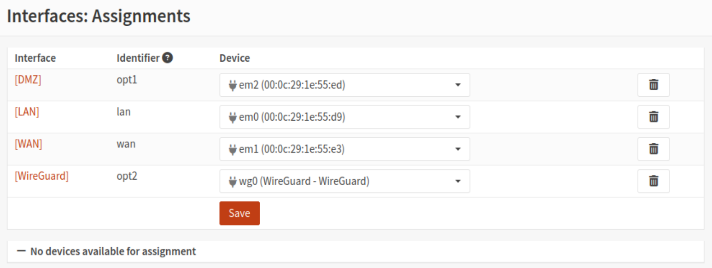
> 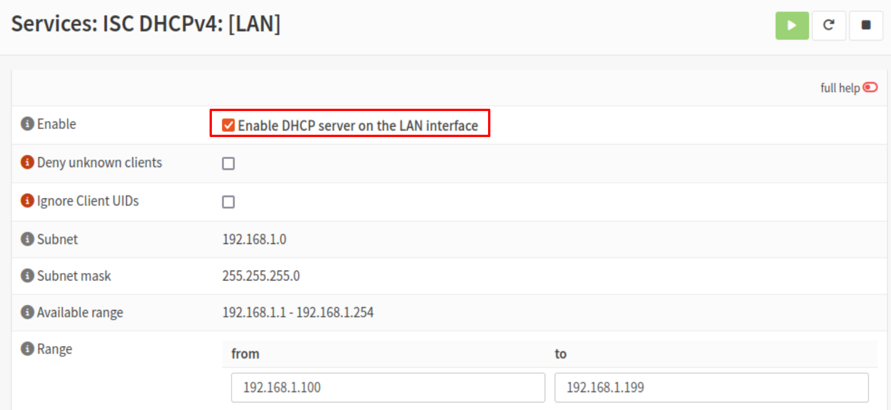
> 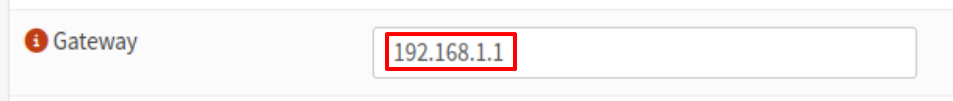
> 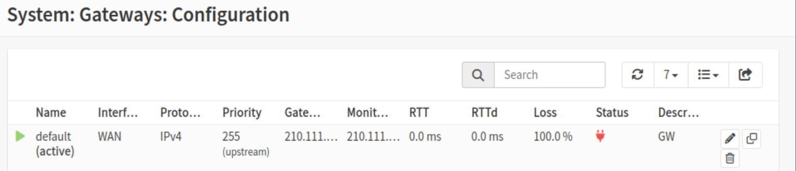
> 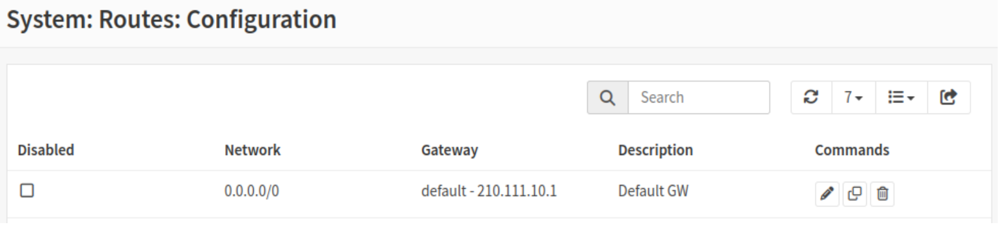
> 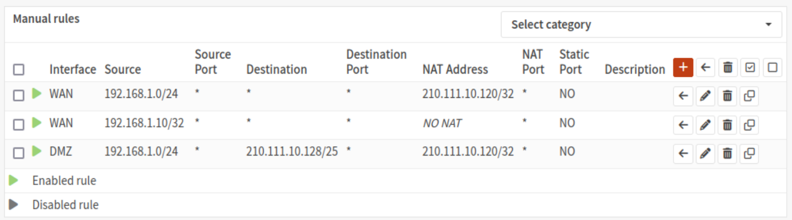
> 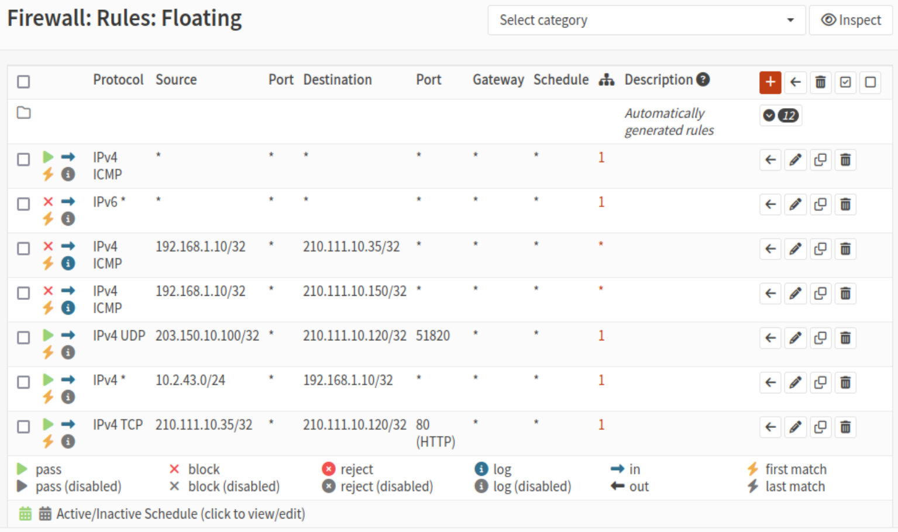
> 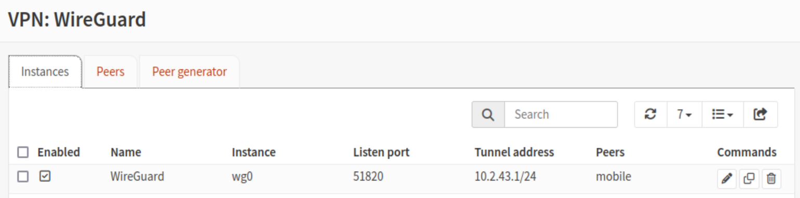
> 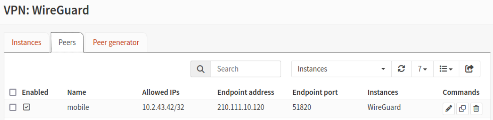
> 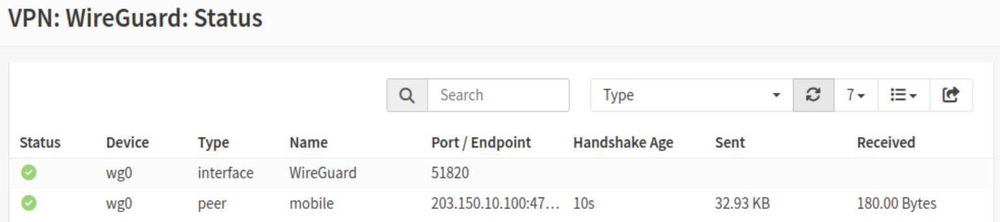
> 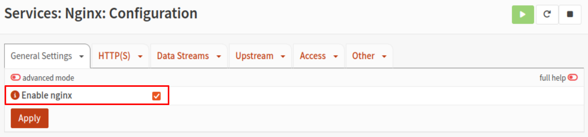
> 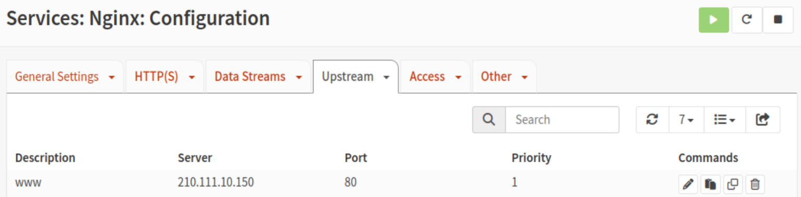
> 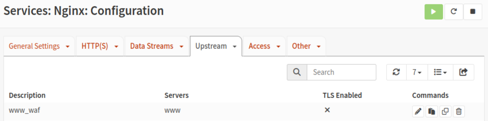
> 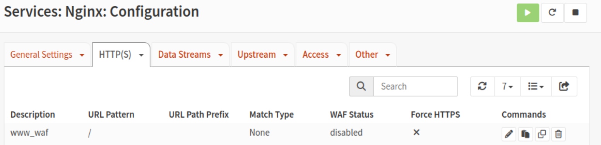
> 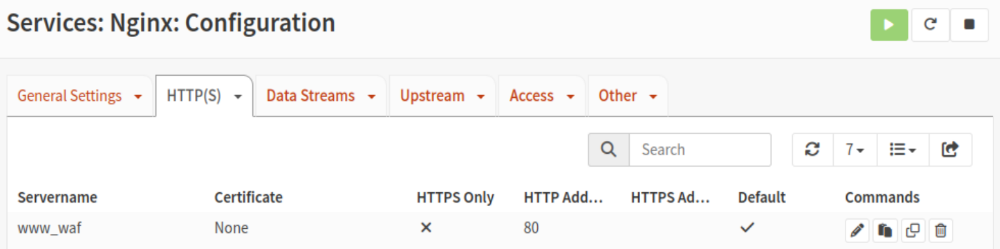
> 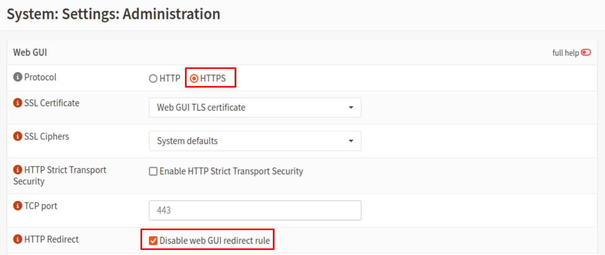
> 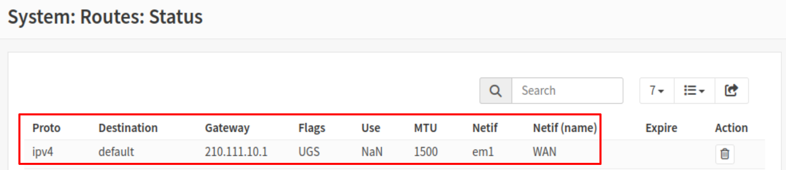

---

## 4) www 서버(DVWA) 확인 (DMZ)

> 배포물에 Docker 구성이 포함되어 있다고 가정.

```vim
# 컨테이너 확인
docker ps -a
# DVWA 서버 포트가 80로 뜨는지 확인
ss -lntp | grep 80
```

> 방화벽 요구사항상 OUTSIDE/MOBILITY는 **UTM WAF(210.111.10.120:80)** 로만 접속 가능. INSIDE는 `210.111.10.150`(직접) 또는 `210.111.10.120`(WAF) 모두 가능해야 함.

---

## 5) mobile(클라이언트) WireGuard 설정

### 5-1. 클라이언트 설정파일(`/etc/wireguard/wg0.conf`)

```ini
[Interface]
Address = 10.2.43.42/24
PrivateKey = <mobile-private-key>

[Peer]
PublicKey = <UTM-public-key>
Endpoint = 210.111.10.120:51820   # UTM WAN
AllowedIPs = 10.2.43.0/24, 192.168.1.0/24
PersistentKeepalive = 25
```

### 5-2. 가동/부팅연동

```vim
wg-quick up wg0
systemctl enable --now wg-quick@wg0
ip addr show wg0
ping -c 2 10.2.43.1
ping -c 2 192.168.1.10  # INSIDE server와 통신되어야 함
```

---

## 6) 검증 시나리오 (필수)

### 6-1. ICMP 전면 허용 확인

* `client / server / www / router / mobile / attacker` 각 호스트에서 상호 **ping** 정상 확인.

### 6-2. INSIDE → DMZ

```vim
# client(INSIDE) → www(DMZ)
curl -I http://210.111.10.150   # 200 OK
ping -c 2 210.111.10.150         # 성공

# server(INSIDE) → DMZ/OUTSIDE는 차단되어야 함
curl -I http://210.111.10.150   # 실패 (방화벽 로그 체크)
curl -I http://210.111.10.1     # 실패
```

### 6-3. OUTSIDE/MOBILITY → www 직접 접속 차단 + WAF 경유 허용

```vim
# attacker(OUTSIDE): DMZ 직접 접속 → 차단되어야 함
curl -I http://210.111.10.150   # 실패

# WAF 경유
curl -I http://210.111.10.120   # 200/301 등 프록시 응답
```

### 6-4. WAF 차단 테스트 (Command Injection)

```vim
# DVWA의 Command Injection 페이지 (로그인/보안레벨 조정 후)
# 공격 페이로드 : localhost && ls -l
curl "http://210.111.10.120/vulnerabilities/exec/#"
# → ModSecurity 차단 페이지/403 확인
```

### 6-5. MOBILITY(mobile) VPN 검증

```vim
# mobile에서
ping -c 2 10.2.43.1       # UTM WG 터널
ping -c 2 192.168.1.10    # INSIDE server

# server에서 VPN 대역과 통신 허용 확인(다른 외부는 차단 유지)
ping -c 2 10.2.43.42
```

---

## 7) VMnet 관련 주의 (요구사항 반영)

* **VMnet 목록에서 문제에 없는 VMnet 제거**
* **HOST1의 VMnet DHCP 기능 전부 비활성**
* **OUTSIDE는 각 HOST의 NIC를 브리지**
* **HOST2는 SW1(실물)과 물리 1개 케이블만 연결**

> 위 항목은 VMware Virtual Network Editor에서 처리. 적용 후 각 VM NIC가 올바른 VMnet에 연결되었는지 재검증.

---

## 8) 트러블슈팅 & 로그 체크포인트

* **OPNsense 방화벽 로그**: 모든 정책에 **Log** 활성했으므로 상단 매치 여부 확인.
* **Nginx/ModSecurity 로그**: 차단 이벤트(rule id/phase) 확인, 필요 시 false-positive 룰 예외 추가(단, 과제 범위 내에서 명령주입은 차단되도록 유지).
* **WireGuard**: `wg show`에서 핸드셰이크/전송 바이트 확인. AllowedIPs 양끝 일치 필수.

---

> ✅ 이 문서만으로 **과제 전 항목**(IPv6 차단, ICMP 허용, INSIDE↔DMZ 정책, OUTSIDE/MOBILITY 접근, DHCP, NAT, WAF, WireGuard, Router 경로/포워딩)을 **명령어/설정 값**까지 설정 가능
